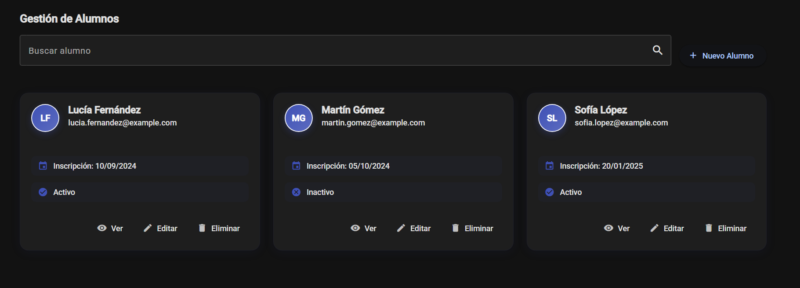
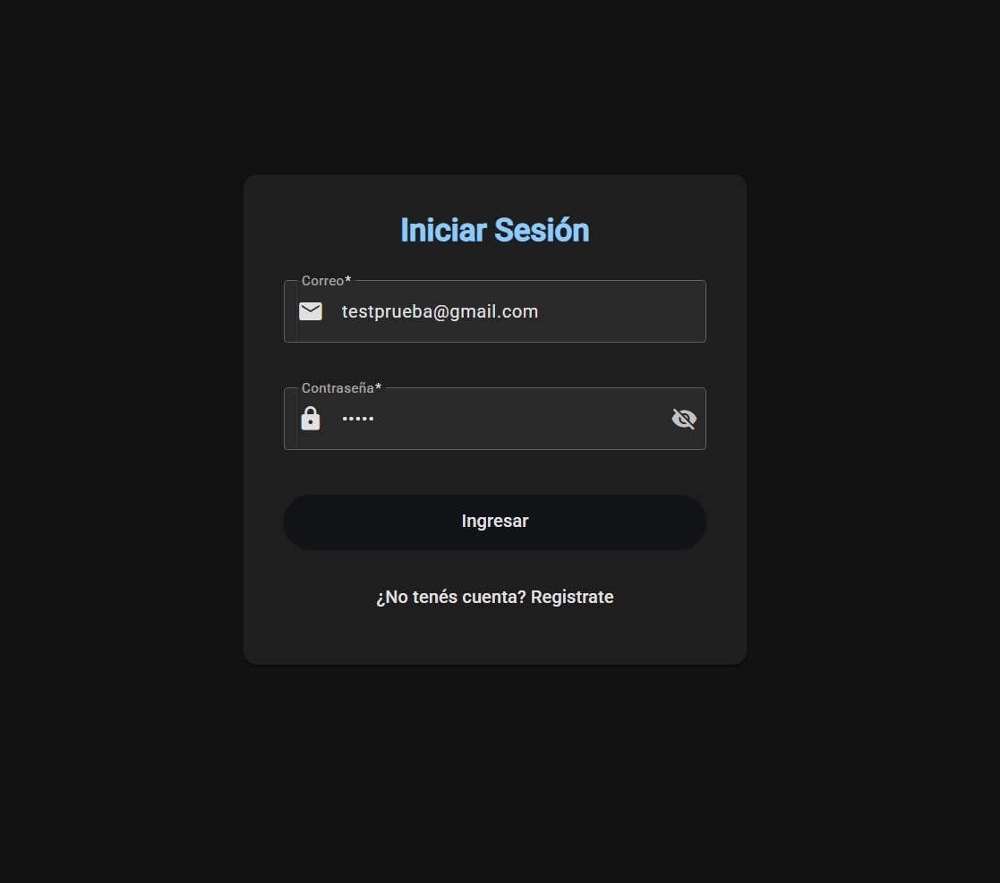

# 3PF-Baez — Sistema de Gestión Educativa
**Nicolás Báez** | Curso Angular - CoderHouse

Aplicación web completa para administración académica: CRUD de Alumnos y Cursos, autenticación con NgRx Store, guards de protección de rutas, API REST con JSON Server, arquitectura modular (Core, Features, Shared), lazy loading, testing unitario, formularios reactivos y Angular Material para interfaz moderna.

## 🚀 Ejecución

### Pasos para ejecutar
1. **Clonar el repositorio**
```bash
   git clone https://github.com/114032-Baez-Nicolas/3PF_Baez.git
   cd 3PF_Baez
```

2. **Instalar dependencias**
```bash
   npm install
```

3. **Ejecutar JSON Server (Base de datos)**
```bash
   json-server --watch data/db.json --port 3000
```

4. **Ejecutar la aplicación Angular**
```bash
   ng serve
```

5. **Abrir en el navegador**
```
   http://localhost:4200/login
```

### Credenciales de prueba
- **Usuario:** `testprueba@gmail.com`
- **Contraseña:** `1234p`

## 🛠️ Tecnologías

- **Angular** 20.3.2
- **Angular Material** - UI Components
- **NgRx Store** - Gestión de estado
- **TypeScript** - Lenguaje principal  
- **JSON Server** - API REST simulada
- **SweetAlert2** - Notificaciones
- **UUID** - Identificadores únicos
- **Jasmine** - Testing unitario

## ⚡ Funcionalidades

### Gestión Académica
- ✅ CRUD completo de Alumnos
- ✅ CRUD completo de Cursos
- ✅ Búsqueda y filtrado en tiempo real
- ✅ Interfaz responsive con cards modernas

### Arquitectura y Seguridad
- ✅ **Lazy Loading** con rutas child
- ✅ **Guards de autenticación** protegiendo rutas
- ✅ **API REST** con JSON Server en puerto 3000
- ✅ **NgRx Store** para manejo de estado global
- ✅ **Testing unitario** de servicios y componentes

### Funcionalidades Técnicas
- ✅ Formularios reactivos con validaciones
- ✅ Pipe personalizado `nombreCompleto`
- ✅ Directiva personalizada `tituloResaltado`  
- ✅ Sintaxis moderna Angular (@if, @for)
- ✅ Modo oscuro/claro
- ✅ Navegación con Angular Router

## 📸 Capturas de Pantalla

### Gestión de Alumnos

*Lista de alumnos con búsqueda y acciones CRUD*

### Gestión de Cursos  

*Lista de cursos con estados y fechas*

### Login / Autenticación

*Sistema de autenticación con modo oscuro*

## 📂 Estructura del Proyecto
```
src/app/
├── core/           # Servicios, guards, modelos
├── features/       # Módulos de funcionalidad
│   ├── auth/       # Autenticación
│   ├── alumnos/    # Gestión de alumnos
│   ├── cursos/     # Gestión de cursos
│   └── dashboard/  # Página de inicio
├── shared/         # Pipes, directivas, componentes compartidos
└── layout/         # Navbar, toolbar
```

## 🧪 Testing

Ejecutar tests unitarios:
```bash
ng test
```

El proyecto incluye tests para:
- Servicios (AuthService, AlumnosService, CursosService)
- Componentes (Lista y ABM de alumnos/cursos)

## 📋 Requisitos Entrega 3

- [x] **Lazy loading y rutas child**
- [x] **Guards y autenticación de usuario**  
- [x] **API REST con JSON Server**
- [x] **Unit Testing de servicios y componentes**
- [x] **Angular Material para UI**
- [x] **NgRx Store para gestión de estado**
- [x] **Sintaxis moderna de Angular**

## ⚠️ Notas

- La aplicación requiere **JSON Server** ejecutándose en puerto 3000
- **No deployada** en Vercel/GitHub Pages debido a la dependencia de base de datos local
- Usar credenciales de prueba para acceder al sistema

---
**Nicolás Báez** - CoderHouse Angular
